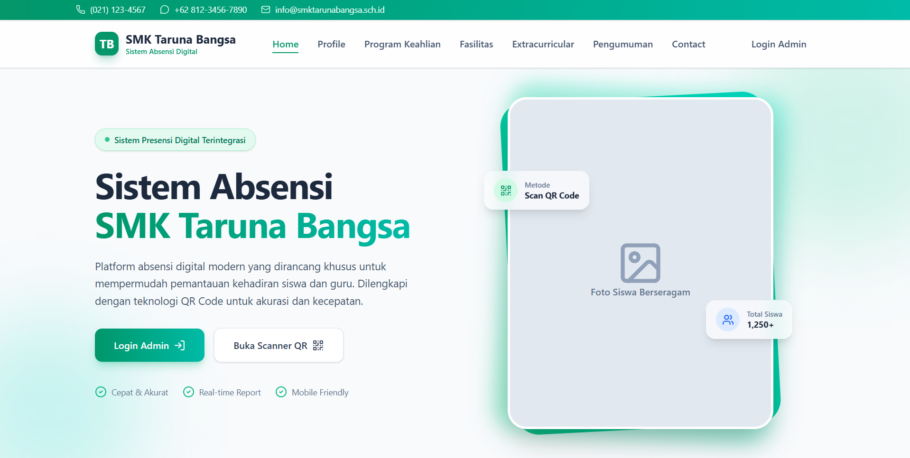
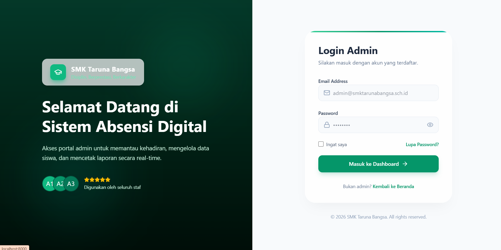
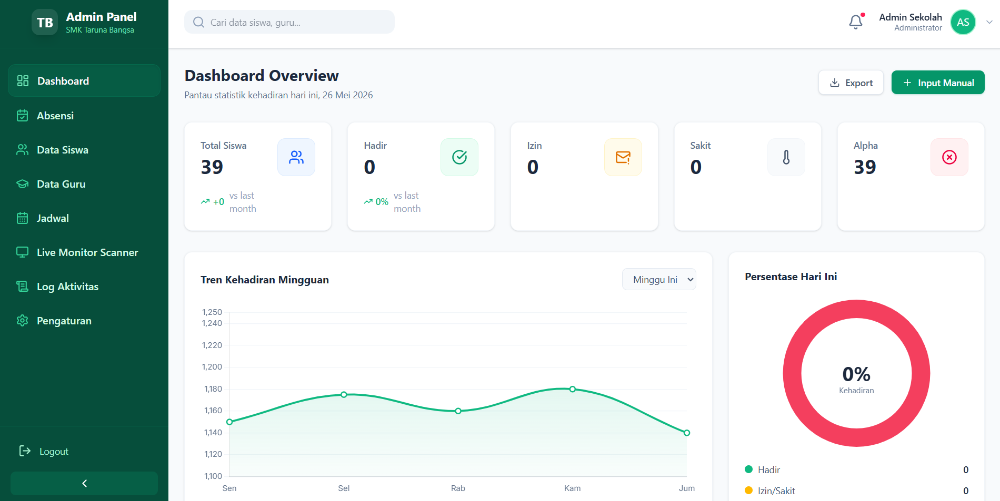
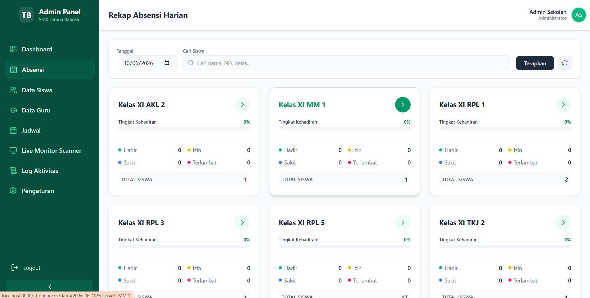
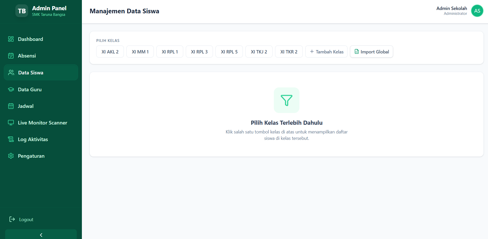
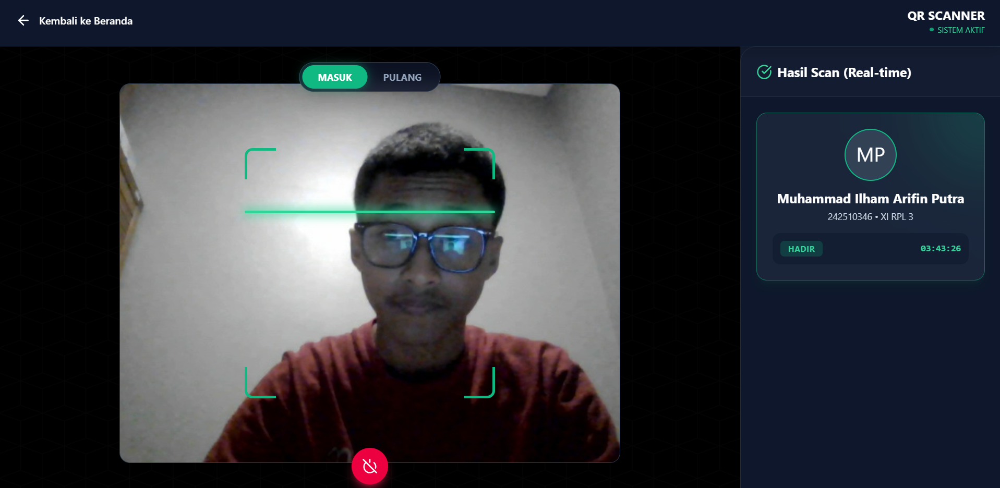
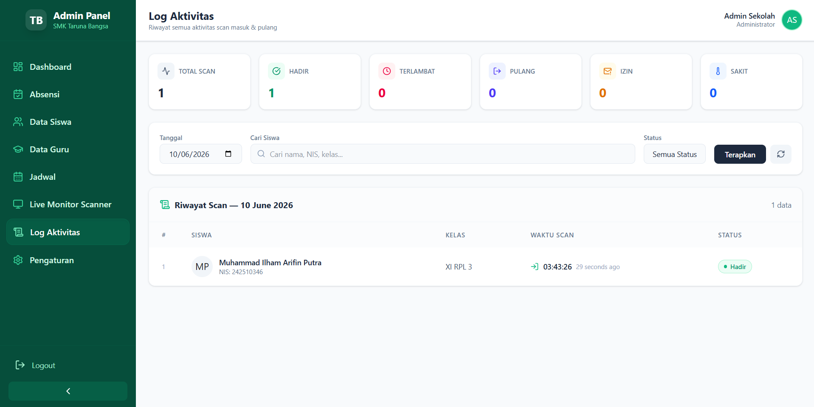

# Sistem Absensi Digital - SMK Taruna Bangsa

Platform absensi digital modern yang dirancang khusus untuk mempermudah pemantauan kehadiran siswa dan guru di SMK Taruna Bangsa. Dilengkapi dengan teknologi QR Code untuk akurasi dan kecepatan.

## Fitur Utama
- **Cepat & Akurat**: Menggunakan metode Scan QR Code.
- **Real-time Report**: Pantau data absensi secara langsung.
- **Mobile Friendly**: Bisa diakses dari berbagai perangkat.
- **Admin Dashboard**: Kelola data siswa, guru, jadwal, dan rekap absensi harian dengan mudah.

## Screenshots Aplikasi

### 1. Landing Page


### 2. Login Admin


### 3. Admin Dashboard


### 4. Rekap Absensi


### 5. Fitur Lainnya 1 (Silakan Ubah Judul)


### 6. Fitur Lainnya 2 (Silakan Ubah Judul)


### 7. Fitur Lainnya 3 (Silakan Ubah Judul)


## Instalasi (Development)

1. Clone repository ini:
   ```bash
   git clone <URL_REPOSITORY_ANDA>
   ```
2. Copy `.env.example` ke `.env` dan sesuaikan konfigurasi database:
   ```bash
   cp .env.example .env
   ```
3. Install dependensi Composer dan NPM:
   ```bash
   composer install
   npm install
   ```
4. Generate application key:
   ```bash
   php artisan key:generate
   ```
5. Jalankan migrasi dan seeder:
   ```bash
   php artisan migrate --seed
   ```
6. Jalankan server lokal:
   ```bash
   php artisan serve
   npm run dev
   ```

## Lisensi
Hak Cipta &copy; 2026 SMK Taruna Bangsa. All rights reserved.
